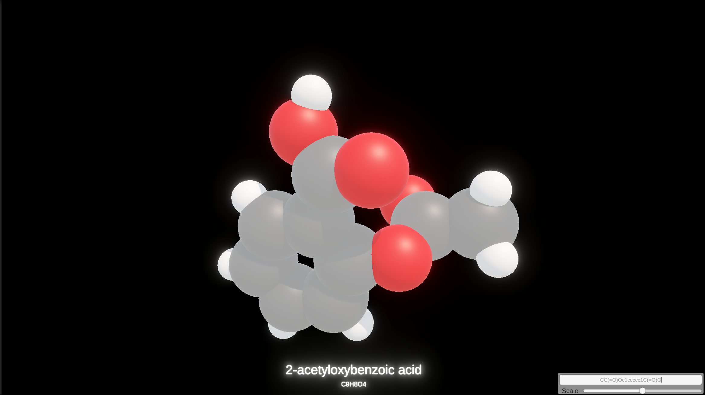

# Naïl PERREAU

### Computer Science Student | C++ Systems & Real-Time 3D Applications

📍 Visiting Scholar @ UC Berkeley • Final-Year Computer Science Student @ EPITECH Paris

[LinkedIn](https://www.linkedin.com/in/nailperreau/) • [GitHub](https://github.com/nperreau) • [Email](mailto:nailperreau@gmail.com) • [Resume](resume.pdf)

---

## 🚀 About Me

I am a final-year Computer Science student at EPITECH Paris, currently a Visiting Scholar at UC Berkeley.

My interests lie at the intersection of systems programming and real-time 3D applications. I enjoy building software that requires careful attention to performance, architecture, and user experience—from low-level C/C++ development to interactive visualization tools.

- 🔭 **Current Focus:** C/C++ systems development, performance-oriented software engineering, and real-time 3D applications.
- 🌱 **Exploring:** Software architecture, performance optimization, parallel programming, and cheminformatics.
- ⚡ **Philosophy:** Build clean, decoupled systems first; optimize bottlenecks where performance actually matters.

<!--
I'll uncomment that when the public github-readme-stats.vercel.app deployment will be back up.
## 📊 GitHub Stats

  
  

---
-->

---

## 🛠️ Technical Skills

| Category | Technologies |
|-----------|-------------|
| **Languages** | C, C++, C#, Python, JavaScript |
| **Graphics & Visualization** | Unity, Real-Time 3D Development |
| **Mobile Development** | Xamarin, .NET MAUI, Android |
| **Scientific Software** | RDKit, PubChem API |
| **Tools & DevOps** | Git, Docker, CI/CD |
| **Other** | Raspberry Pi, PowerShell, ESP32 |

---

## 💻 Featured Project

### [Molecule Viewer 🔬](https://github.com/nperreau/MoleculeViewer)

  

Interactive desktop application for real-time visualization of molecular structures.

**Tech Stack:** Unity, C#, RDKit, .NET, PubChem API

#### Highlights

- Converts SMILES representations into interactive 3D molecular models.
- Retrieves molecular metadata and IUPAC nomenclature from PubChem.
- Uses asynchronous API communication to prevent blocking the rendering pipeline.
- Optimizes mesh generation for responsive visualization of complex molecules.

#### Why I Built It

I wanted to explore the intersection of scientific software and real-time graphics. This project combines cheminformatics tooling with modern visualization techniques to make molecular data more accessible and interactive.

🔗 **Repository:** [Molecule Viewer](https://github.com/nperreau/MoleculeViewer)

---

## 🏆 Experience

### Sony — C++ / CI-CD Developer Intern
*May 2023 – Dec 2023*

- Developed a native C++ DAW plugin for capturing real-time audio and streaming data to an external AI service.
- Designed and maintained CI/CD automation pipelines to accelerate build and deployment workflows.
- Continued development of a successful university-industry partnership project that led directly to the internship.

### CNES (French Space Agency) — AR / Mobile Simulation Intern
*Jun 2018 – Jul 2018*

- Developed an Augmented Reality simulation application using Unity and C#.
- Managed 3D asset integration and optimized performance for mobile devices.

### DSI Services — Mobile & Systems Developer
*Jul 2022 – Dec 2022*

- Developed and deployed a production B2B application using Xamarin.
- Participated in the migration path toward .NET MAUI following its release.
- Automated large-scale document migration workflows using PowerShell.

### Cisco — Embedded Systems & IoT Intern
*Jun 2019 – Jul 2019*

- Developed a Raspberry Pi application for collecting and transmitting environmental sensor data.
- Built a JavaScript Slack chatbot for querying real-time monitoring information.

### Groupe Atlantic — Mobile Application & Market Research Intern
*Jan 2023 – Jun 2023*

- Developed a mobile prototype featuring a conversational interface for residential energy management.
- Conducted market and competitor analysis to support product planning.

### GuestViews — Mobile Developer Intern
*Jun 2016*

- Contributed to the rapid deployment of the company's Android application using a native WebView architecture.

---

## 📚 Current Interests

- Modern C++20/23 (and experimenting with C++26)
- Systems Programming
- Performance Optimization
- Memory Management & Allocators
- Real-Time Rendering

---

## 📫 Contact

Feel free to reach out if you'd like to discuss software engineering, systems programming, graphics, or interesting technical projects.

📧 **[nailperreau@gmail.com](mailto:nailperreau@gmail.com)**
